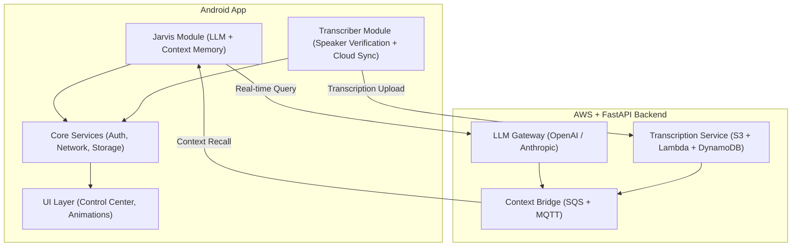

# ⚒️ Frontier Audio Assistant

<p align="center">
  <strong>Jarvis + Always-On Transcriber for the Modern Frontline</strong><br>
  <em>Real-time AI voice assistance and selective speech transcription built for mission-critical work.</em>
</p>

<p align="center">
  
  
  
</p>

---

## 🧭 Overview

**Frontier Audio Assistant** is an Android platform designed for **frontline operators, field technicians, and emergency teams** who need reliable, low-latency voice AI — without compromising privacy or control.
It merges two systems:

* **🧠 Jarvis** — a real-time, context-aware voice assistant powered by state-of-the-art LLMs.
* **🎧 Always-On Transcriber** — a selective speaker recorder that captures only the authorized user's speech, storing transcriptions securely in the cloud.

Together, they form a **mission-grade communication system**: accurate, secure, and built to perform under pressure.

---

## ⚙️ Core Features

| Module                    | Capabilities                                                            | Technologies                           |
| ------------------------- | ----------------------------------------------------------------------- | -------------------------------------- |
| **Jarvis AI Assistant**   | Realtime speech recognition, context recall, interruptible LLM sessions | Kotlin, FastAPI, OpenAI/Anthropic APIs |
| **Selective Transcriber** | Continuous background capture, speaker verification, timestamped logs   | TensorFlow Lite, AWS Lambda, S3        |
| **Shared Core**           | Auth, encryption, network sync, unified Control Center                  | Kotlin Coroutines, DataStore, AWS SDK  |
| **UX Layer**              | Dark tactical theme with orange highlights, high-contrast readability   | Jetpack Compose, MotionLayout          |

---

## 🧱 Architecture



---

## 🧩 Modular Independence

Both modules can operate independently:

| Mode                 | Description                             | Active Modules     |
| -------------------- | --------------------------------------- | ------------------ |
| **Jarvis Mode**      | AI assistant only                       | Jarvis + Core      |
| **Transcriber Mode** | Background selective transcription      | Transcriber + Core |
| **Combined Mode**    | Jarvis integrates with live transcripts | All modules        |

Each component communicates through the **Frontier Context Bus** — a lightweight Kotlin Flow event system designed for scalability and modularity.

---

## 🧠 Tech Stack

```text
Frontend:   Kotlin • Jetpack Compose • Hilt • DataStore
Backend:    FastAPI • AWS Lambda • DynamoDB • S3
AI Stack:   OpenAI GPT / Anthropic Claude • TensorFlow Lite
Infra:      AWS Gateway • SQS • MQTT • CI/CD via GitHub Actions
```

---

## 🖥️ Visual Identity

| Element           | Specification                                      |
| ----------------- | -------------------------------------------------- |
| **Primary Color** | `#FF6A00` (Safety Orange)                          |
| **Background**    | `#0C0D0F` (Matte Black)                            |
| **Typography**    | Space Grotesk (Headings), Inter (Body)             |
| **Style**         | Industrial, masculine, tactical                    |
| **Readability**   | +2sp font scale, high-contrast text                |
| **Motion**        | Pulsing halos, waveform feedback, snap transitions |

> *“Built to withstand the field — both visually and functionally.”*

---

## 🔐 Security and Compliance

* End-to-end **AES-256** encryption for all transcripts
* **Speaker verification** ensures data belongs only to authorized users
* Full compliance with **GDPR**, **CCPA**, and **HIPAA-aligned** guidelines
* User control: **pause, delete, or export** data at any time

---

## 🧭 Development Roadmap

| Phase     | Focus                  | Key Deliverables                               |
| --------- | ---------------------- | ---------------------------------------------- |
| **PR-01** | Core Framework         | Dependency injection, permissions, CI/CD setup |
| **PR-02** | Audio + Speaker ID     | Continuous audio pipeline, voice enrollment    |
| **PR-03** | Cloud Transcription    | WebSocket streaming, metadata tagging          |
| **PR-04** | Jarvis Core            | LLM query orchestration, TTS, interruptibility |
| **PR-05** | Context Sync           | Kotlin Flow event bus, context bridge          |
| **PR-06** | UX Polish              | Dark theme, state animations, control center   |
| **PR-07** | Security               | AES-256 encryption, GDPR/CCPA compliance       |
| **PR-08** | Optimization           | WER < 5%, latency < 500ms                      |
| **PR-09** | Telemetry & Deployment | Analytics, logging, Play Store beta            |

---

## 🧰 Local Development Setup

```bash
# Clone the repository
git clone https://github.com/frontieraudio/assistant.git
cd assistant

# Set up environment variables
cp .env.example .env
# Fill in API keys for OpenAI, AWS, etc.

# Build and run
./gradlew assembleDebug
adb install app/build/outputs/apk/debug/app-debug.apk
```

### AWS Transcribe credentials for local testing

1. Open `local.properties` (never committed) at the project root.
2. Add your temporary credentials (recommended: use `aws-vault` or `aws sts assume-role` against the Terraform-created role):

   ```
   frontier.aws.transcribeAccessKeyId=AKIA***
   frontier.aws.transcribeSecretAccessKey=****
   frontier.aws.transcribeSessionToken=****
   frontier.aws.region=us-west-2
   frontier.aws.transcribeEnabled=true
   ```

   Leave `frontier.aws.transcribeSessionToken` empty if you are using long-lived keys (not recommended).
3. Rebuild the project. The values are injected into `BuildConfig` and consumed by the `DefaultChainTranscribeCredentialsProvider`, falling back to the standard AWS credential chain if all three fields are blank.

---

## 🔊 Speaker Verification Model

The transcriber module expects a TensorFlow Lite **speaker embedding / verification** model at runtime.  
We recommend the **FRILL** variant from Google’s [Non-Semantic Speech Benchmark](https://www.kaggle.com/models/google/nonsemantic-speech-benchmark/tfLite).

1. Download the `frill.tflite` model from Kaggle (requires a Google account and acceptance of the model license).  
2. Rename the file to `speaker_verification.tflite`.  
3. Place it at `transcriber/src/main/assets/models/speaker_verification.tflite`.  

> Note: Large model binaries are intentionally excluded from version control (see `.gitignore`).  
> When the file is absent, the app falls back to an “unknown speaker” mode so that audio capture continues.

---

## 🧡 Contributing

Frontier Audio is built for those who thrive where **precision matters** — EMTs, engineers, construction leads, and developers alike.

If you want to contribute:

1. Fork the repo
2. Create your feature branch: `git checkout -b feature/awesome`
3. Commit your changes: `git commit -m 'Add new capability'`
4. Push the branch and open a PR

We welcome developers with backgrounds in **real-time systems, signal processing, and UX for mission-critical apps**.

---

## 📡 Contact

**Frontier Audio Team**
📧 [support@frontieraudio.io](mailto:support@frontieraudio.com)
🌐 [frontieraudio.io](https://frontieraudio.com)
🧱 Built by professionals, for professionals.

---

<p align="center">
  
  <br><br>
  <strong><em>“Designed for the field. Built for the mission.”</em></strong>
</p>
